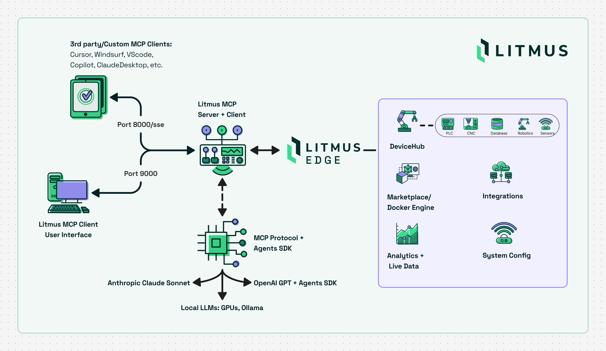

<p align="center">
  <a href="https://litmus.io">
    <picture>
      <source media="(prefers-color-scheme: light)" srcset="static/litmus-logo-light.svg" />
      <source media="(prefers-color-scheme: dark)" srcset="static/litmus-logo-dark.svg" />
      
    </picture>
  </a>
</p>

<p align="center">
  <a href="https://docs.litmus.io">
    
  </a>
  <a href="https://www.linkedin.com/company/litmus-automation/" >
    
  </a>
</p>

# Litmus MCP Server

The official [Litmus Automation](https://litmus.io) **Model Context Protocol (MCP) Server** enables LLMs and intelligent systems to interact with [Litmus Edge](https://litmus.io/products/litmus-edge) for device configuration, monitoring, and management. It is built on top of the MCP SDK and adheres to the [Model Context Protocol spec](https://modelcontextprotocol.io/).

<div>
  <picture>
      <source media="(prefers-color-scheme: light)" srcset="static/MCP-server-arch-diagram.png" />
      
  </picture>
</div>

## Table of Contents

- [Quick Launch](#quick-launch)
  - [Web UI](#web-ui)
  - [Claude Code CLI](#claude-code-cli)
  - [Cursor IDE](#cursor-ide)
  - [VS Code / Copilot](#vs-code--github-copilot)
  - [Windsurf](#windsurf)
- [STDIO - Claude Desktop](#stdio-with-claude-desktop)
- [Tips](#Tips)
- [Tools](#available-tools)
- [Litmus Central](#litmus-central)
---

## Quick Launch

### Start an HTTP SSE MCP Server using Docker

Run the server in Docker (HTTP SSE only)

```bash
docker run -d --name litmus-mcp-server -p 8000:8000 ghcr.io/litmusautomation/litmus-mcp-server:latest
```

NOTE: The Litmus MCP Server is built for linux/AMD64 platforms. If running in Docker on ARM64, specify the AMD64 platform type by including the --platform argument:

```bash
docker run -d --name litmus-mcp-server --platform linux/amd64 -p 8000:8000 ghcr.io/litmusautomation/litmus-mcp-server:main
```

---

## Web UI

The Docker image includes a built-in chat interface that lets you interact with Litmus Edge using natural language — no MCP client configuration required.

Start the server with both ports exposed:

```bash
docker run -d --name litmus-mcp-server \
  -p 8000:8000 -p 9000:9000 \
  -e ANTHROPIC_API_KEY=<key> \
  ghcr.io/litmusautomation/litmus-mcp-server:latest
```

- **`:9000`** — Web UI (chat interface). Open `http://localhost:9000` in your browser, add a Litmus Edge instance via the config page, and start chatting.
- **`:8000`** — SSE endpoint for external MCP clients (Claude Desktop, Cursor, VS Code, etc.) — still available as normal.

If you deploy the MCP server and web client on separate hosts, set `MCP_SSE_URL` to point the web client at the server:

```bash
-e MCP_SSE_URL=http://<mcp-server-host>:8000/sse
```

### Claude Code CLI
Run Claude from a directory that includes a configuration file at `~/.claude/mcp.json`:

```json
{
  "mcpServers": {
    "litmus-mcp-server": {
      "type": "sse",
      "url": "http://localhost:8000/sse",
      "headers": {
        "EDGE_URL": "${EDGE_URL}",
        "EDGE_API_CLIENT_ID": "${EDGE_API_CLIENT_ID}",
        "EDGE_API_CLIENT_SECRET": "${EDGE_API_CLIENT_SECRET}",
        "NATS_SOURCE": "${NATS_SOURCE}",
        "NATS_PORT": "${NATS_PORT:-4222}",
        "NATS_USER": "${NATS_USER}",
        "NATS_PASSWORD": "${NATS_PASSWORD}",
        "INFLUX_HOST": "${INFLUX_HOST}",
        "INFLUX_PORT": "${INFLUX_PORT:-8086}",
        "INFLUX_DB_NAME": "${INFLUX_DB_NAME:-tsdata}",
        "INFLUX_USERNAME": "${INFLUX_USERNAME}",
        "INFLUX_PASSWORD": "${INFLUX_PASSWORD}"
      }
    }
  }
}
```
[Anthropic Docs](https://docs.anthropic.com/en/docs/agents-and-tools/mcp)

---

### Cursor IDE 

Add to `~/.cursor/mcp.json` or `.cursor/mcp.json`:

```json
{
  "mcpServers": {
    "litmus-mcp-server": {
      "url": "http://<MCP_SERVER_IP>:8000/sse",
      "headers": {
        "EDGE_URL": "https://<LITMUSEDGE_IP>",
        "EDGE_API_CLIENT_ID": "<oauth2_client_id>",
        "EDGE_API_CLIENT_SECRET": "<oauth2_client_secret>",
        "NATS_SOURCE": "<LITMUSEDGE_IP>",
        "NATS_PORT": "4222",
        "NATS_USER": "<access_token_username>",
        "NATS_PASSWORD": "<access_token_from_litmusedge>",
        "INFLUX_HOST": "<LITMUSEDGE_IP>",
        "INFLUX_PORT": "8086",
        "INFLUX_DB_NAME": "tsdata",
        "INFLUX_USERNAME": "<datahub_username>",
        "INFLUX_PASSWORD": "<datahub_password>"
      }
    }
  }
}
```
[Cursor docs](https://docs.cursor.com/context/model-context-protocol)

---

### VS Code / GitHub Copilot

#### Manual Configuration

In VS Code:
Open User Settings (JSON) → Add:

```json
{
  "mcpServers": {
    "litmus-mcp-server": {
      "url": "http://<MCP_SERVER_IP>:8000/sse",
      "headers": {
        "EDGE_URL": "https://<LITMUSEDGE_IP>",
        "EDGE_API_CLIENT_ID": "<oauth2_client_id>",
        "EDGE_API_CLIENT_SECRET": "<oauth2_client_secret>",
        "NATS_SOURCE": "<LITMUSEDGE_IP>",
        "NATS_PORT": "4222",
        "NATS_USER": "<access_token_username>",
        "NATS_PASSWORD": "<access_token_from_litmusedge>",
        "INFLUX_HOST": "<LITMUSEDGE_IP>",
        "INFLUX_PORT": "8086",
        "INFLUX_DB_NAME": "tsdata",
        "INFLUX_USERNAME": "<datahub_username>",
        "INFLUX_PASSWORD": "<datahub_password>"
      }
    }
  }
}
```

Or use `.vscode/mcp.json` in your project.

[VS Code MCP Docs](https://code.visualstudio.com/docs/copilot/chat/mcp-servers)

---

### Windsurf

Add to `~/.codeium/windsurf/mcp_config.json`:

```json
{
  "mcpServers": {
    "litmus-mcp-server": {
      "url": "http://<MCP_SERVER_IP>:8000/sse",
      "headers": {
        "EDGE_URL": "https://<LITMUSEDGE_IP>",
        "EDGE_API_CLIENT_ID": "<oauth2_client_id>",
        "EDGE_API_CLIENT_SECRET": "<oauth2_client_secret>",
        "NATS_SOURCE": "<LITMUSEDGE_IP>",
        "NATS_PORT": "4222",
        "NATS_USER": "<access_token_username>",
        "NATS_PASSWORD": "<access_token_from_litmusedge>",
        "INFLUX_HOST": "<LITMUSEDGE_IP>",
        "INFLUX_PORT": "8086",
        "INFLUX_DB_NAME": "tsdata",
        "INFLUX_USERNAME": "<datahub_username>",
        "INFLUX_PASSWORD": "<datahub_password>"
      }
    }
  }
}
```

[Windsurf MCP Docs](https://docs.windsurf.com/windsurf/mcp)

## STDIO with Claude Desktop

This MCP server supports local connections with Claude Desktop and other applications via Standard file Input/Output (STDIO): https://modelcontextprotocol.io/legacy/concepts/transports

To use STDIO: Clone, edit config.py to enable STDIO, run the server as a local process, and update Claude Desktop MCP server configuration file to use the server:

### Clone
```bash
# Clone 
git clone https://github.com/litmusautomation/litmus-mcp-server.git
```

### Set ENABLE_STDIO to 'true' in /src/config.py:
```python
ENABLE_STDIO = os.getenv("ENABLE_STDIO", "true").lower() in ("true", "1", "yes")
```

### Run the server
```bash
# Run using uv 
uv sync
cd /path/to/litmus-mcp-server
uv run python3 src/server.py

# Otherwise
cd litmus-mcp-server
pip install -e .
python3 src/server.py
```

### Add json server definision to your Claude Desktop config file:
- macOS: `~/Library/Application Support/Claude/claude_desktop_config.json`
- Windows: `%APPDATA%\Claude\claude_desktop_config.json`
- Linux: `~/.config/Claude/claude_desktop_config.json`

```json
{
  "mcpServers": {
    "litmus-mcp-server": {
      "command": "/path/to/.venv/bin/python3",
      "args": [
        "/absolute/path/to/litmus-mcp-server/src/server.py"
      ],
      "env": {
        "PYTHONPATH": "/absolute/path/to/litmus-mcp-server/src",
        "EDGE_URL": "https://<LITMUSEDGE_IP>",
        "EDGE_API_CLIENT_ID": "<oauth2_client_id>",
        "EDGE_API_CLIENT_SECRET": "<oauth2_client_secret>",
        "NATS_SOURCE": "<LITMUSEDGE_IP>",
        "NATS_PORT": "4222",
        "NATS_USER": "<access_token_username>",
        "NATS_PASSWORD": "<access_token_from_litmusedge>",
        "INFLUX_HOST": "<LITMUSEDGE_IP>",
        "INFLUX_PORT": "8086",
        "INFLUX_DB_NAME": "tsdata",
        "INFLUX_USERNAME": "<datahub_username>",
        "INFLUX_PASSWORD": "<datahub_password>"
      }
    }
  }
}
```

## Tips

For development, use Python **Virtual environments**, for example to bridge mcp lib version diffs between dev clients like 'npx @modelcontextprotocol/inspector' & litmus-mcp-server

```json
{
  "mcpServers": {
    "litmus-mcp-server": {
      "command": "/absolute/path/to/litmus-mcp-server/.venv/bin/python",
      "args": ["/absolute/path/to/litmus-mcp-server/src/server.py"],
      "env": { /* same as above */ }
    }
  }
}
```

See [claude_desktop_config_venv.example.json](claude_desktop_config_venv.example.json) for the complete template.

**Header Configuration Guide:**
- `EDGE_URL`: Litmus Edge base URL (include https://)
- `EDGE_API_CLIENT_ID` / `EDGE_API_CLIENT_SECRET`: OAuth2 credentials from Litmus Edge
- `NATS_SOURCE`: Litmus Edge IP (no http/https)
- `NATS_USER` / `NATS_PASSWORD`: Access token credentials from **System → Access Control → Tokens**
- `INFLUX_HOST`: Litmus Edge IP (no http/https)
- `INFLUX_USERNAME` / `INFLUX_PASSWORD`: DataHub user credentials

---

## Available Tools

| Category                  | Function Name                         | Description |
|---------------------------|----------------------------------------|-------------|
| **DeviceHub**             | `get_litmusedge_driver_list`           | List supported Litmus Edge drivers (e.g., ModbusTCP, OPCUA, BACnet). |
|                           | `get_devicehub_devices`                | List all configured DeviceHub devices with connection settings and status. |
|                           | `create_devicehub_device`              | Create a new device with specified driver and default configuration. |
|                           | `get_devicehub_device_tags`            | Retrieve all tags (data points/registers) for a specific device. |
|                           | `get_current_value_of_devicehub_tag`   | Read the current real-time value of a specific device tag. |
| **Device Identity**       | `get_litmusedge_friendly_name`         | Get the human-readable name assigned to the Litmus Edge device. |
|                           | `set_litmusedge_friendly_name`         | Update the friendly name of the Litmus Edge device. |
| **LEM Integration**       | `get_cloud_activation_status`          | Check cloud registration and Litmus Edge Manager (LEM) connection status. |
| **Docker Management**     | `get_all_containers_on_litmusedge`     | List all Docker containers running on Litmus Edge Marketplace. |
|                           | `run_docker_container_on_litmusedge`   | Deploy and run a new Docker container on Litmus Edge Marketplace. |
| **NATS Topics** *         | `get_current_value_from_topic`         | Subscribe to a NATS topic and return the next published message. |
|                           | `get_multiple_values_from_topic`       | Collect multiple sequential values from a NATS topic for trend analysis. |
| **InfluxDB** **           | `get_historical_data_from_influxdb`    | Query historical time-series data from InfluxDB by measurement and time range. |
| **Digital Twins**         | `list_digital_twin_models`             | List all Digital Twin models with ID, name, description, and version. |
|                           | `list_digital_twin_instances`          | List all Digital Twin instances or filter by model ID. |
|                           | `create_digital_twin_instance`         | Create a new Digital Twin instance from an existing model. |
|                           | `list_static_attributes`               | List static attributes (fixed key-value pairs) for a model or instance. |
|                           | `list_dynamic_attributes`              | List dynamic attributes (real-time data points) for a model or instance. |
|                           | `list_transformations`                 | List data transformation rules configured for a Digital Twin model. |
|                           | `get_digital_twin_hierarchy`           | Get the hierarchy configuration for a Digital Twin model. |
|                           | `save_digital_twin_hierarchy`          | Save a new hierarchy configuration to a Digital Twin model. |

### Tool Use Notes

**\* NATS Topic Tools Requirements:**
To use `get_current_value_from_topic` and `get_multiple_values_from_topic`, you must configure access control on Litmus Edge:
1. Navigate to: **Litmus Edge → System → Access Control → Tokens**
2. Create or configure an access token with appropriate permissions
3. Provide the token in your MCP client configuration headers

**\*\* InfluxDB Tools Requirements:**
To use `get_historical_data_from_influxdb`, you must allow InfluxDB port access:
1. Navigate to: **Litmus Edge → System → Network → Firewall**
2. Add a firewall rule to allow port **8086** on **TCP**
3. Ensure InfluxDB is accessible from the MCP server host

---

## Litmus Central

Download or try Litmus Edge via [Litmus Central](https://central.litmus.io).

---

### MCP server registries

- [Glama](https://glama.ai/mcp/servers/@litmusautomation/litmus-mcp-server)

 <a href="https://glama.ai/mcp/servers/@litmusautomation/litmus-mcp-server">
 
 </a>

- [MCP.so](https://mcp.so/server/litmus-mcp-server/litmusautomation)

---

© 2026 Litmus Automation, Inc. All rights reserved.
